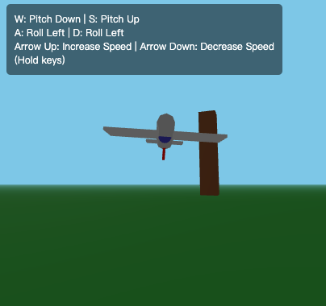

# Sky Voyager - Three.js Flight Simulator

一个基于 Three.js 的简单飞行模拟器演示项目。在这个项目中，你可以控制一架低多边形风格的飞机在3D空间中飞行，体验基础的飞行物理效果。


## 如何复现
### https://aistudio.google.com
(需魔法)选择Gemini 2.5 pro 0325模型
### prompt
```
In pure three.js, without downloading any assets or textures, create a flight simulator game where i can fly an airplane. Make sure it runs in the browser.
```

## 功能特点

- 3D 低多边形风格飞机模型
- 基础飞行物理系统
- 平滑的相机跟随效果
- 随机生成的地形和障碍物
- 基础的碰撞检测
- 大气效果（雾效）

## 控制方式

- W：向下俯冲
- S：向上爬升
- A：向左倾斜
- D：向右倾斜
- ↑：加速
- ↓：减速

## 技术栈

- Three.js - 3D 图形引擎
- 原生 JavaScript
- HTML5 Canvas

## 快速开始

1. 克隆仓库：
```bash
git clone https://github.com/quint11/sky-voyager-threejs.git

2. 进入项目目录：
```bash
cd sky-voyager-threejs
 ```
3. 使用本地服务器运行项目（例如使用 Python 的 HTTP 服务器）：
```bash
python -m http.server 8000
 ```
4. 在浏览器中访问： http://localhost:8000